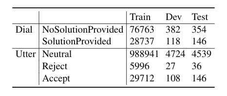
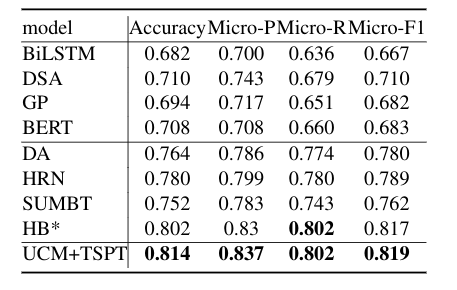

# UCM

This repository contains the source code and data for the ICASSP 2021 paper:

HAVE YOU MADE A DECISION? WHERE? A PILOT STUDY ON INTERPRETABILITY OFPOLARITY ANALYSIS BASED ON ADVISING PROBLEM

## Dependencies

Python 3.6
Tensorflow 1.14.0


## Dataset statistics




## Results




## Test the trained model

A checkpoint is saved in scripts/runs/restore/
The test can be conducted directly

```
cd scripts
bash eval.sh
```

## Get the results of all evaluation matrics
```
python evaluation_metric.py
```


## Train a new model
```
cd scripts
bash train_ucm.sh
```


## Cite
@INPROCEEDINGS{9413654,
  author={Li, Tianda and Gu, Jia-Chen and Liu, Hui and Liu, Quan and Ling, Zhen-Hua and Su, Zhiming and Zhu, Xiaodan},
  booktitle={ICASSP 2021 - 2021 IEEE International Conference on Acoustics, Speech and Signal Processing (ICASSP)}, 
  title={Have You Made a Decision? Where? A Pilot Study on Interpretability of Polarity Analysis Based on Advising Problem}, 
  year={2021},
  volume={},
  number={},
  pages={6928-6932},
  doi={10.1109/ICASSP39728.2021.9413654}}
